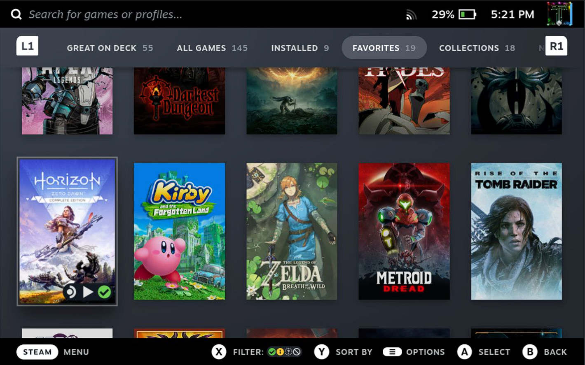

# Tweak Engine

A plugin to tweak various parts of SteamOS.

 
 

# Overview
This plugin provides options to tweak various parts of SteamOS.
 
 

# Feature Requests and Contributing
Got an idea for a new tweak? Fork Tweak Engine, make your tweak, and then making a PR here. I will review it when I have time and merge it if there are no issues. (Read more below)
 
 
Don't have the technical knowhow to make one yourself? Well there's no time like the present to start learning!
 
 
Jokes aside, please feel free to open an `issue` on Tweak Engine's Github repository with a subject formatted like so: `Tweak: your idea`. I will review it when I have the chance and if it seems like a good suggestion I will try to implement it.
 
 

# Contributing your own Tweaks
In order to add a tweak, you need to add an entry to the default settings in `main.py`, create a new tweak in `src/lib/tweaks`, and register it in `src/lib/TweakEngineManager.ts`.

## Updating the default settings
In the `main.py` file there is a `defaults` property on the Plugin class. Add an entry with the name of your tweak. Make sure it is short and replace any spaces with a `-`. Initialize it to `False`.

## Creating your tweak
<!-- remember to add copyright to file -->

## Registering your tweak

 
 

# Installation
1. [Install the Decky plugin loader](https://github.com/SteamDeckHomebrew/decky-loader#installation)
2. Use the built in plugin store to download the Tweak Engine Plugin